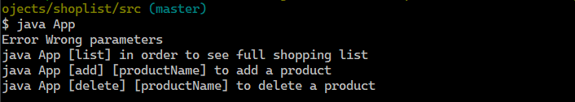
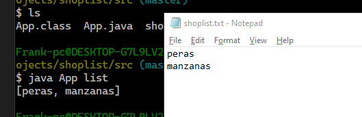
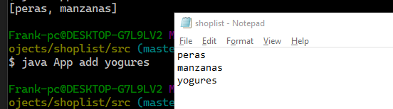
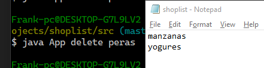

# Shopping list creator
Simple programa para practicar la entrada de parametros por consola y la escritura y lectura de ficheros en java.
El programa te permite crear tu lista de la compra añadiendo o eliminando articulos y guardandolos en un .txt

## Errores

Si se meten los parametros incorrectos mostrará este mensaje con los comandos validos

Si el archivo shoplist.txt no existe que es donde se guardara nuestra lista de la compra nos dara este mensaje

## Listar

Lee el archivo .txt y muestra una lista de los productos

## Añadir

el comando add Añade un producto a nuestra lista de la compra

## Eliminar

el comando delete elimina un producto de nuestra lista de la compra (si existe)

